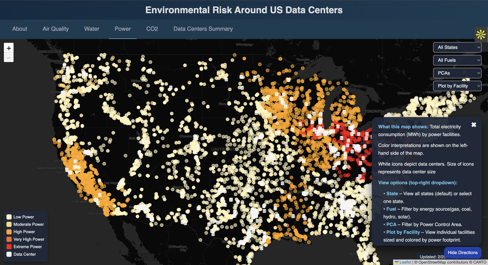

# Environmental Risk Around US Data Centers

An interactive web application that visualizes the environmental impact of data centers across the United States. The app combines **air quality**, **water footprint**, **power consumption**, and **carbon emissions** with **data center locations** to help users explore how digital infrastructure interacts with local environmental conditions.

## Dashboard Preview

<p align="center">
  
</p>

##  Business Question

As hyperscale data centers expand rapidly across the United States, understanding their localized environmental impact is critical for urban planners, sustainability teams, and infrastructure investors.

This project answers:

**Which U.S. regions face the highest environmental risk from data center expansion, and what underlying factors drive that risk?**

The goal is to move beyond raw metrics and provide a data-driven risk lens to support responsible digital infrastructure planning.

---

## What This Project Does

This project is an exploratory visualization and analytics tool designed to analyze **indirect environmental impacts** associated with data center electricity demand across the United States.

The application does **not** measure emissions, water use, or air pollution directly from individual data centers. Instead, it visualizes impacts derived from **regional electricity generation and supporting infrastructure** that supply power to data centers.

The goal is to support:

- comparative analysis  
- spatial exploration  
- scenario reasoning  

—not causal attribution or precise forecasting.

---

## Key Definitions and Data Interpretation 

### Power (Electricity Consumption)
Estimated electricity demand attributed to data center operations and supplied by regional power grids.

### Carbon Footprint
CO₂-equivalent emissions associated with electricity generation used by data centers, calculated using grid-level carbon intensity factors.

### Water Footprint
Water consumed by power generation and cooling processes required to supply electricity to data centers.

### Air Quality (AQI)
Ambient air quality conditions (PM2.5, Ozone) near data center regions, based on public monitoring data. AQI values provide environmental context and are not direct emissions from data centers.

## Core Capabilities

- Multi-layer visualization of environmental impacts linked to data center electricity demand
- Comparative analysis across air quality, water footprint, power consumption, and carbon emissions
- Facility-level and state-level aggregation for spatial analysis
- Scenario-based projections for future water and carbon impacts
- Interactive geospatial exploration using consistent filtering across layers


##  Key Insights

- Data center clusters in regions with carbon-intensive electricity grids (e.g., parts of the Midwest and South) exhibit higher indirect emissions exposure compared to regions powered by cleaner energy mixes.

- Water stress risk is unevenly distributed across the U.S., with several fast-growing data center markets located in moderately to highly water-stressed regions, indicating potential sustainability constraints.

- Spatial analysis shows that environmental impact is driven more strongly by **regional energy mix** than by the raw count of data centers alone.

- High-density data center corridors reveal compounding environmental pressure when elevated power demand coincides with poor regional air quality baselines.

These findings highlight the importance of region-aware infrastructure planning rather than uniform national expansion strategies.

##  Analytical Methodology

The analysis integrates geospatial data center locations with regional environmental indicators to enable comparative risk exploration.

**Data Integration**

- Mapped U.S. data center locations to regional electricity and environmental datasets  
- Combined air quality index, water stress indicators, power consumption proxies, and carbon intensity signals  
- Standardized heterogeneous features using min-max normalization for cross-factor comparison  

**Exploratory Analysis**

- Performed correlation analysis to understand relationships between environmental factors  
- Conducted regional comparisons to identify geographic concentration of risk drivers  
- Built interactive visualizations to support spatial reasoning and scenario exploration  

##  Quantitative Validation

To ensure the composite risk signal was meaningful:

- Feature correlation analysis confirmed non-redundant contribution of environmental factors
- Sensitivity testing showed stable regional rankings under moderate weight perturbations
- Risk score distribution exhibited strong geographic separation between low- and high-impact regions

These checks provide confidence that the risk index captures meaningful environmental variation rather than visualization artifacts.

## Tech Stack

**Frontend**

- Plain HTML, CSS, and JavaScript (single-page app in `app.html`)  
- [Leaflet](https://leafletjs.com/) for interactive mapping and layers  
- [Tailwind CSS](https://tailwindcss.com/) + [DaisyUI](https://daisyui.com/) for UI styling  
- [Chart.js](https://www.chartjs.org/) for summary and “More Insights” charts  

**Backend**

- [Flask](https://flask.palletsprojects.com/) web framework  
- [flask-cors](https://flask-cors.readthedocs.io/) for CORS handling  
- [gunicorn](https://gunicorn.org/) for production serving (via `Procfile`)  

**Data & Processing**

- CSV data files for monitors and environmental metrics (e.g., AQI, water footprint, power usage)  
- [pandas](https://pandas.pydata.org/) and [NumPy](https://numpy.org/) for preprocessing and aggregation  
- Timezone handling via `pytz`  

## Getting Started (Local Development)

Clone the repository:

```bash
git clone https://github.com/StutiiiG/data-center-impact.git
cd data-center-impact
````

Create and activate a virtual environment:

```bash
python -m venv .venv

# Windows
.venv\Scripts\activate

# macOS / Linux
source .venv/bin/activate
```

Install dependencies:

```bash
pip install -r requirements.txt
```

Run the backend server:

```bash
python backend.py
```

Backend will start on:

```text
http://127.0.0.1:5000
```

Open the frontend:

**Option A – Served from Flask (if configured)**

```text
http://127.0.0.1:5000/
```

**Option B – Serve app.html statically**

```bash
python -m http.server 8000
```

Then visit:

```text
http://127.0.0.1:8000/app.html
```

Make sure the frontend API URLs match your backend environment (local vs deployed).

## Data Sources

### Current Impacts

**Electricity, Water & Carbon**

- **Source:** *The Environmental Footprint of Data Centers in the United States* (Virginia Tech)  
- **Link:** https://data.lib.vt.edu/articles/dataset/The_environmental_footprint_of_data_centers_in_the_United_States/14504913  
- **Description:** Provides estimates of electricity consumption, water usage, and carbon emissions associated with U.S. data centers. These datasets form the basis of the static impact analyses used in this project.

**Air Quality**

- **Source:** AirNow (U.S. Environmental Protection Agency)  
- **Link:** https://www.airnow.gov/  
- **Description:** Public air quality monitoring data used to represent ambient conditions (e.g., PM2.5 and Ozone) in regions surrounding data center locations.

### Future Projections (Carbon and Water)

- **Source:** *US-AI-Server-Analysis* (PEESE Group)  
- **Link:** https://github.com/PEESEgroup/US-AI-Server-Analysis  
- **Description:** The `dc_impact_summary.csv` file was generated by computing and aggregating scenario-based outputs from this repository to support visualization of projected future water use and carbon emissions.

## Reuse and Extension 

To reuse or extend this project:
- Replace or add datasets in the `data/` directory
- Update backend aggregation logic to support new metrics or resolutions
- Add new map layers following the existing Leaflet + filtering pattern

The visualization framework is intentionally modular to support additional environmental or infrastructure datasets.

## License

This project is licensed under the MIT License. See the `LICENSE` file for details.

## Citation

If you use this project or derived datasets in academic or applied work,
please cite it using the provided `CITATION.cff` file.


